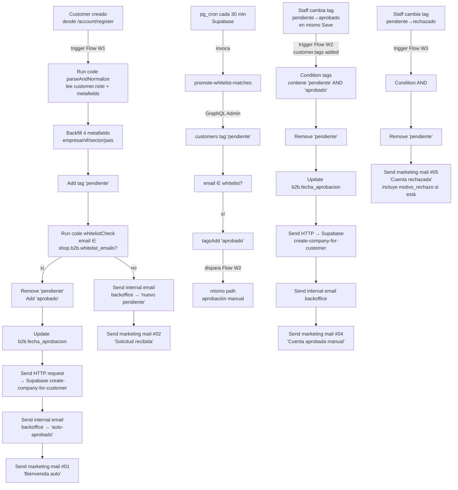

# Arquitectura — LedsC4 B2B Outlet

Fuente de verdad técnica del portal post-Fase D (deploy 2026-04-29).
Sustituye al documento de kickoff `LedsC4_Arquitectura_F0.docx` (abril 2025),
que queda como referencia histórica de qué se prometió al cliente. Ver
[docs/historia-decisiones.md](historia-decisiones.md) para las decisiones
que cambiaron por el camino.

Lectura objetivo: 15 minutos para alguien nuevo en el proyecto.

---

## 1. Resumen ejecutivo

LedsC4 B2B Outlet es un **portal mayorista privado** sobre Shopify para
liquidar fin de colección a clientes profesionales (instaladores,
arquitectos, retail, distribuidores). El portal vive en
`ledsc4-b2b-outlet.myshopify.com`, comparte tienda con la web pública de
LedsC4 a través de B2B nativo de Shopify (no es un store separado), y solo
muestra catálogo y precios a clientes que pasan por un proceso de alta y
aprobación manual o por whitelist.

Estado a 2026-05-04: **Fases A, B, C y D entregadas y en producción** sobre
el plan Development de Shopify. Tienda operativa con 745 SKUs publicados
en el catálogo "Outlet general", flujo de registro y aprobación funcionando
(W1–W3 en Shopify Flow + W4 en Supabase cron), gate de storefront híbrido
(Locksmith + Liquid en `theme.liquid`), formulario de solicitud de pedido
que crea Draft Orders con HMAC, y branding de la pantalla de login
aplicado vía Branding API. Pendiente para Grow: activar `Send marketing
mail` en los Flows y rediseño visual de los 5 emails marketing — ver
[docs/grow-migration-checklist.md](grow-migration-checklist.md).

Lo que aún **no** está hecho y queda fuera de las cuatro fases entregadas:
el conector con el ERP del cliente (Microsoft AX) — el alta inicial de
catálogo Excel multi-hoja y la sincronización recurrente CSV cada 6h
descritas en §9 — y el rediseño visual de los emails. Cualquier otra cosa
es perfectamente extensible sobre la arquitectura actual.

---

## 2. Stack real

| Pieza | Rol | Por qué frente a alternativas |
|---|---|---|
| **Shopify Plan Grow** (target) / Development (actual) | Tienda + B2B nativo + Custom roles + Shopify Messaging | Necesario para B2B nativo + roles custom. Basic no expone ninguno. Plus es desproporcionado para volumen y precio. Ver [ADR D1](historia-decisiones.md#d1-plan-grow). |
| **Shopify B2B nativo** (Companies, Catalogs, Price Lists) | Modelo de datos comercial: 1 customer ⇄ 1 Company ⇄ 1 Location ⇄ catálogo "Outlet general" | Wholesale Club + Customer Fields era la alternativa "Basic-friendly" pero implicaba dos modelos paralelos (price list vs custom field) y obligaba a duplicar lógica en Liquid. Ver [ADR D2](historia-decisiones.md#d2-b2b-nativo). |
| **Locksmith** (app) | Gate de catálogo (Lock 806866) — únicamente la Rule 2 ("solo aprobados ven productos/colecciones/cart/search") | App estable, granular y barata. La intención original era 3 locks; al fallar la instalación del segundo lock con "High-level job failure", se replegó a 1 lock + gate Liquid. Ver [ADR D4](historia-decisiones.md#d4-gate-h%C3%ADbrido). |
| **Liquid en `layout/theme.liquid`** | Rules 1 y 3 del gate (anónimo→login, rechazado→cuenta-rechazada) + redirect `/checkout`→`/cart` para aprobados | Backup redundante que cubre lo que Locksmith no instala. Coste cero, totalmente reversible. |
| **Shopify Flow** | Workflows W1, W2, W3, W5 — automatización al crear customer, al cambiar tags, al crear draft order | Built-in, sin coste extra, integración directa con triggers de customer/draft. Mechanic era la otra opción y costaba 9$/mes con menos triggers nativos. Ver [ADR D3](historia-decisiones.md#d3-flow--supabase). |
| **Supabase** (4 edge functions + pg_cron) | W4 (whitelist re-evaluation cada 30 min) + W1/W2 helper (`create-company-for-customer`) + Fase D (`submit-order-request` + `list-order-requests`) | Flow Run code es sandbox puro: sin `async`, sin `fetch`, sin `shopify.graphql`. No se puede iterar customers ni crear Companies B2B desde ahí. Supabase aporta Postgres, cron y un runtime Deno completo. Ver [ADR D3](historia-decisiones.md#d3-flow--supabase). |
| **Tema Dawn customizado** (GitHub-conectado) | Storefront. Forkado del Dawn upstream + customizaciones B2B (header simple, dashboard aprobado, páginas status, formulario solicitud, mis-solicitudes) | Dawn es el tema oficial Shopify, mantenido y compatible con todas las features 2.0. La rama `main` del repo está conectada al tema live: cada commit despliega en ~30-60s. Sync semanal con Dawn upstream vía GitHub Actions (`.github/workflows/dawn-sync.yml`). |
| **New customer accounts** (Shopify-hosted) | Login, registro, recuperación de contraseña, cuenta del cliente | **No es elección nuestra** — Shopify lo forzó en 2025, el sistema classic se deprecó. Branding personalizado vía Checkout Branding API (logo, fuentes, colores). Ver [ADR D5](historia-decisiones.md#d5-new-customer-accounts). |
| **GitHub** | Versionado del tema + pipeline GitHub→Shopify + GitHub Actions (Dawn sync) | La conexión nativa GitHub↔Shopify hace que `main` sea la rama de producción sin necesidad de scripts de deploy. |

---

## 3. Modelo de datos

Detalle completo en [docs/data-model.md](data-model.md). Resumen para
contextualizar el resto del documento:

- **3 tags canónicos en Customer**, mutuamente excluyentes:
  `pendiente`, `aprobado`, `rechazado`. Auditados por
  `scripts/audit-customer-state.js`.
- **2 metafields a nivel Shop** (namespace `b2b`): `whitelist_emails`
  (lista) y `email_backoffice` (string).
- **8 metafields a nivel Customer** (namespace `b2b`): `empresa`, `nif`,
  `sector`, `pais`, `volumen_estimado`, `fecha_registro`,
  `fecha_aprobacion`, `motivo_rechazo`.
- **1 catálogo B2B** activo: "Outlet general" (price list 0% sobre shop,
  EUR), publicación filtrada por la smart collection `coleccion-2026`
  (regla `product_tag EQUALS Coleccion:2026`), 745 productos publicados.
- **Asignación 1-a-1**: cada Customer aprobado tiene una Company de un
  miembro, con una CompanyLocation asignada al catálogo. Arquitectura
  multi-catalog-ready (ver [§8](#8-cat%C3%A1logo-y-producto)).

Aplicado en código por scripts idempotentes en `scripts/` (ver §11 del
data-model).

---

## 4. Flujo de registro y aprobación

Detalle paso a paso en `flows/W1-walkthrough.md`,
`flows/W2-walkthrough.md`, `flows/W3-walkthrough.md` y
`flows/W4-walkthrough.md`. Los `*-walkthrough.md` son la fuente de verdad
del "cómo está desplegado"; los `*-registro.md`, `*-aprobacion-manual.md`
y `*-rechazo-manual.md` originales describen el diseño conceptual previo
a las limitaciones descubiertas en Flow.



Tres puntos importantes:

- **W4 vive en Supabase**, no en Shopify Flow. Razón: Flow Run code no
  permite `async`, `fetch` ni `shopify.graphql`, así que iterar la lista
  de pendientes y aplicar mutaciones desde un trigger Scheduled era
  imposible. La edge function `promote-whitelist-matches` corre cada 30
  min vía `pg_cron`, lee la whitelist, pagina pendientes, aplica
  `tagsAdd 'aprobado'` a los matches, y eso dispara W2 en Shopify Flow
  (mismo path que la aprobación manual). Ver
  [flows/W4-walkthrough.md](../flows/W4-walkthrough.md) y
  [supabase/README.md](../supabase/README.md).
- **`create-company-for-customer`** (edge function Supabase) es invocada
  por W1 (rama whitelist) y W2 (rama aprobado). Crea Company B2B +
  Contact + Location y asigna la Location al catálogo "Outlet general".
  Idempotente. Es el helper que sustituye la acción "Crear Company" que
  Flow no expone.
- **Caveat**: la condición de W2/W3 requiere que el staff cambie ambos
  tags (quitar `pendiente` + añadir `aprobado`/`rechazado`) en **un único
  Save**. Si los hace en dos Saves separados, el segundo trigger ya no
  ve `pendiente` en `customer.tags` y la condición falla. Documentado
  para staff en [docs/backoffice-aprobaciones.md §3.1](backoffice-aprobaciones.md).

Emails:

| # | Plantilla | Disparador | Destinatario |
|---|---|---|---|
| 1 | `01-bienvenida-auto.liquid` | W1 rama whitelist | cliente |
| 2 | `02-solicitud-recibida.liquid` | W1 rama pendiente | cliente |
| 3 | `03-backoffice-nuevo-pendiente.liquid` | W1 rama pendiente | backoffice |
| 4 | `04-cuenta-aprobada-manual.liquid` | W2 | cliente |
| 5 | `05-cuenta-rechazada.liquid` | W3 | cliente |
| 6 | `06-bienvenida-reevaluacion.liquid` | W4-Supabase tras whitelist match | cliente |
| 7 | `07-solicitud-recibida.liquid` | W5 (Fase D) | cliente |
| 7b | `07b-backoffice-nueva-solicitud.liquid` | W5 | backoffice |

Los emails 1–6 al cliente son **marketing mails de Shopify Messaging**
(quedan en draft en plan Development; se envían al pasar a Grow). El 7 al
cliente igual. Los emails al backoffice (3, 7b) son
`Send internal email` con body inline en el Flow — no aceptan variables
en el campo To, por eso el destinatario está hardcoded
(ver [docs/hardcoded-emails.md](hardcoded-emails.md)).

---

## 5. Storefront gate

Detalle completo en [docs/locksmith-rules.md](locksmith-rules.md). Resumen:

**Implementación híbrida tras el bug "High-level job failure" de Locksmith
en abril 2026** — el plan original de 3 locks Locksmith colapsó al
intentar instalar el segundo lock Entire Store (ver [ADR D4](historia-decisiones.md#d4-gate-h%C3%ADbrido)).

- **Locksmith Rule 2 (Lock 806866)** — scope productos + colección `all`.
  Redirect on lock = `/pages/cuenta-en-revision` para no-key-holders.
  Key 1084647: `customer_signed_in` + `customer_tag = aprobado`,
  Redirect URL **vacío** (gotcha histórico — ver
  [§Gotcha redirect_url](locksmith-rules.md#%EF%B8%8F-gotcha--redirect_url-en-key-vs-lock-deploy-2026-04-29)).
- **Liquid Rules 1 + 3** en `layout/theme.liquid:329-379` — gate JS
  client-side (`window.location.replace(...)`) que cubre:
  - Anónimo → `/customer_authentication/login?return_to=/pages/mis-solicitudes`
  - `rechazado` → `/pages/cuenta-rechazada`
  - `aprobado` que intenta `/checkout` → `/cart`
  - No aprobado en URLs comerciales (products/collections/cart/search/solicitud) → `/pages/cuenta-en-revision`

**Paths exempt** (acceso libre incluso para anónimos):
`/`, `/account/login`, `/account/register`, `/account/recover`,
`/account/logout`, `/account/sign_out`, `/account/activate/*`,
`/account/reset_password/*`, `/pages/cuenta-en-revision`,
`/pages/cuenta-rechazada`, `/pages/aviso-legal`,
`/pages/politica-de-privacidad`, `/pages/condiciones-de-uso`,
`/pages/canal-de-denuncias`, `/policies/*`.

**Escapes de seguridad**:
- En `Shopify.designMode` (theme editor) el gate no dispara — para no
  bloquear edición del tema.
- En dominios `*.shopifypreview.com` el gate no dispara — porque
  Shopify no whitelistea preview en redirect_uri de OAuth (validación
  funcional del gate solo tras `Publish`).
- En `request.page_type == 'password'` (storefront password protection)
  tampoco dispara.

**Caveat conocido**: el redirect es JavaScript client-side. Un usuario
con JS deshabilitado vería la página antes del redirect. Para B2B con
clientes profesionales se acepta; alternativa futura: meta-refresh
server-side.

---

## 6. New customer accounts

Detalle completo en
[docs/shopify-customer-accounts-branding.md](shopify-customer-accounts-branding.md).

Shopify ha forzado en 2025 el sistema **new customer accounts**: la
pantalla de login (y register, recover, account, addresses…) ya **no se
renderiza desde el tema** sino desde una URL hospedada por Shopify
(`shopify.com/<shop_id>/account/...`). El tema solo recibe peticiones de
las páginas del storefront; la auth pasa por OAuth contra ese subdominio.

Consecuencia para este repo: los archivos `templates/customers/login.json`,
`templates/customers/register.json`, `templates/customers/reset_password.json`
y `sections/main-login.liquid` / `sections/main-register.liquid` /
`sections/main-reset-password.liquid` son del flujo classic (deprecado)
y **no intervienen en el login real**. Se conservan por compatibilidad
si Shopify reactivara classic en el futuro.

**Personalización vía Branding API** (mutación `checkoutBrandingUpsert`
sobre el `CheckoutProfile` publicado — el panel "Checkout & Customer
Accounts" está unificado en Shopify, aunque no se use checkout):

- Logo (PNG, **no SVG**), favicon
- Tipografía (catálogo Shopify Fonts; aquí: Assistant 400/700)
- Paleta (brand `#1A1A1A`, scheme1 fondo `#FFFFFF`, scheme2 fondo `#F5F5F5`)
- Bordes, esquinas, imagen de cover

**Limitaciones (UI propiedad de Shopify, no editables)**:
strings del formulario (`Iniciar sesión`, `Correo electrónico`,
`Continuar`, `Enviar`, `Política de privacidad`), layout, comportamiento
de OTP / magic link.

**Si en el futuro hace falta más customización** (mensaje de bienvenida,
copy B2B, links al portal aprobado): la única vía es un **Customer
Account UI Extension** — extensión de app Shopify, fuera del tema. Es
un módulo de app que se inyecta en zonas predefinidas de la pantalla.
No abordado.

Reproducible vía `scripts/apply-customer-accounts-branding.mjs` (script
idempotente que lee el `.env` del proyecto). Ver [ADR D5](historia-decisiones.md#d5-new-customer-accounts).

---

## 7. Solicitud de pedido (Fase D)

Detalle de UX en [docs/backoffice-solicitudes.md](backoffice-solicitudes.md)
y test scenarios en [docs/test-scenarios-fase-d.md](test-scenarios-fase-d.md).

**Decisión clave**: el checkout nativo de Shopify está **deshabilitado**
para el flujo B2B. El cliente aprobado ve precios y arma carrito, pero
en lugar de "Comprar" pulsa "Confirmar y enviar solicitud", que crea un
**Draft Order** que el backoffice convierte en Order tras revisar
precios/portes/IVA y recibir confirmación del cliente.

```
storefront                                Supabase                            Shopify Admin
-----------                               --------                            --------------
/cart                                                                          
  ↓
/pages/solicitud      ──fetch POST──→  submit-order-request
  (botón confirmar)   {customerId,         ↓ valida HMAC SHA256
                       timestamp,          ↓   (customerId:timestamp,
                       hmac,               ↓    TTL 600s,
                       comentario}         ↓    constant-time compare)
                                           ↓ valida tag 'aprobado'
                                           ↓ duplicate check 60min
                                           ↓ calcula CBM total
                                           ↓ Admin GraphQL mutation
                                           └──→ draftOrderCreate ────────→  Draft Order creado
                                                                              tags: solicitud-b2b
                                                                                    pendiente-revision
                                                                              ↓ trigger Flow W5
                                                                              └→ Run code (flatten)
                                                                                 → Send marketing mail #07 al cliente
                                                                                 → Send internal email al backoffice
  ↓
/pages/solicitud-enviada
```

**Contrato HMAC** (compartido entre Liquid SSR y edge function):

- Mensaje firmado: `<customerId>:<timestamp>` (timestamp en segundos epoch).
- Algoritmo: HMAC-SHA256, hex.
- Secret: `settings.order_request_hmac_secret` en
  `config/settings_data.json` (Liquid lo expone al cliente como hidden
  input al renderizar `/pages/solicitud`) **idéntico** a `ORDER_REQUEST_HMAC_SECRET`
  en Supabase secrets. Si rotas uno, hay que rotar el otro.
- TTL: 600s (10 min). Expirado → 401, el cliente refresca la página y
  reintenta.
- Comparación: constant-time en la edge function (anti-timing attack).

**Tags del Draft Order**:

| Tag | Función |
|---|---|
| `solicitud-b2b` | Identificador permanente. Distingue solicitudes B2B de drafts manuales. **No quitar nunca.** |
| `pendiente-revision` | Estado inicial. Cliente lo ve como ⏳ "En revisión". |
| `en-tramite` | Backoffice empieza a tramitar. Cliente lo ve como 🔄 "En trámite". |
| `confirmada` | Solicitud aprobada (puede generar Order final). Cliente lo ve como ✅ "Confirmada". |
| `cancelada` | Solicitud denegada. Cliente lo ve como ❌ "Cancelada". |

`pendiente-revision`, `en-tramite`, `confirmada`, `cancelada` son
mutuamente excluyentes. El backoffice cambia el estado quitando uno y
añadiendo otro (en un único Save) — ver
[docs/backoffice-solicitudes.md §3](backoffice-solicitudes.md).

**Custom attributes del Draft Order**:

- `fuente` = `solicitud-b2b-frontend`
- `cbm_total` = volumen total m³ calculado sumando `cantidad ×
  metafields.b2b.cbm_caja` de cada line item
- `fecha_solicitud` = ISO timestamp del envío

`/pages/mis-solicitudes` invoca `list-order-requests` con el mismo HMAC
para listar las solicitudes del cliente logueado y mostrar los badges
de estado en tiempo real.

**Lo que aún no hay** (mejora identificada post-MVP en
[docs/test-scenarios-fase-d.md](test-scenarios-fase-d.md)): notificación
automática al cliente cuando el backoffice cambia el estado.

---

## 8. Catálogo y producto

Hoy: **un único catálogo** "Outlet general" — price list 0% sobre los
precios de shop (EUR), publicación filtrada por smart collection
`coleccion-2026` (regla `product_tag EQUALS Coleccion:2026`). 745 SKUs
publicados. Ver [docs/data-model.md §5](data-model.md#5-cat%C3%A1logo-b2b).

Cada Customer aprobado tiene una **Company de un miembro** con una
**CompanyLocation** asignada a este catálogo (asignación que ocurre dentro
de `create-company-for-customer` — la edge function de Supabase invocada
por W1/W2).

**Multi-catalog-ready**: cuando llegue el momento de tener tarifas
diferenciadas (p.ej. por país, sector, volumen), no hace falta refactor.
Basta con:

1. Crear el segundo catálogo con su price list y su publicación (el
   script `scripts/setup-b2b-catalog.mjs` se puede parametrizar fácilmente).
2. Modificar `create-company-for-customer` para decidir el catálogo
   destino según los metafields del customer.
3. Documentar el criterio de asignación.

El modelo de datos ya soporta N catálogos por shop y N CompanyLocations
por catálogo. Lo que es one-and-only-one en este momento es la
**política de negocio**: 1 customer = 1 Company = 1 catálogo. Ver
[ADR D6](historia-decisiones.md#d6-cat%C3%A1logo-%C3%BAnico-multi-ready).

Scripts relevantes (`scripts/`):

| Script | Función |
|---|---|
| `apply-metafield-definitions.mjs` | Crea las 9 metafield definitions. Idempotente. |
| `setup-b2b-catalog.mjs` | Crea smart collection + price list + catalog + publication. Idempotente. |
| `publish-catalog-products.mjs` | Publica productos taggeados `Coleccion:2026` al publication del catalog. Idempotente. |
| `audit-customer-state.js` | Audita invariantes (1 tag de estado, aprobado⇒Company). Reporta CSV en `reports/`. |

---

## 9. Conector ERP — PENDIENTE

**No implementado.** Esta sección documenta lo que se sabe y lo que
falta confirmar para abordarlo.

### Lo que se sabe

- ERP de origen: **Microsoft Dynamics AX**.
- Modo de conexión propuesto: **SFTP** (el ERP escribe ficheros en un
  bucket; el conector los lee).
- Frecuencia de sincronización: **cada 6 horas**.
- **Dos pipelines distintos**, no uno único:

  | Pipeline | Cuándo | Formato | Contenido |
  |---|---|---|---|
  | Alta inicial de catálogo | One-shot al arrancar | Excel multi-hoja | Maestro de productos completo: códigos, descripciones, atributos, jerarquía, precios, dimensiones, fotos |
  | Sincronización recurrente | Cada 6h | CSV de 2 columnas | Probable formato `<sku>,<stock>` o `<sku>,<precio>`. Por confirmar con cliente. |

### Arquitectura prevista

```
Microsoft AX  ──SFTP push──→  bucket  ──poll/cron──→  conector
                                                        ├─ source     (lee SFTP / fichero)
                                                        ├─ parser     (Excel multi-hoja / CSV → records)
                                                        ├─ mapper     (records → modelo Shopify: Product, Variant, Tag, Metafield)
                                                        ├─ writer     (Admin GraphQL — productCreate/Update, productVariantUpdate, …)
                                                        └─ reporter   (logs + métricas + alertas)
```

Probable hosting: **Supabase edge function + cron** (mismo runtime que
W4 y `submit-order-request`), si el procesamiento cabe en los timeouts y
límites de memoria de Deno Edge. Si no, alternativas: GitHub Actions
schedule, Cloudflare Workers, o un pequeño VPS con Node.

La rama `feature/import-pipeline` en este repo contiene exploración
inicial (carpeta `import/`) — no concluida.

### Lo que falta confirmar con el cliente antes de empezar

- Esquema exacto del Excel multi-hoja: nombres de hojas, columnas, tipos.
- Esquema del CSV de 2 columnas (qué representan las dos columnas).
- Credenciales y endpoint SFTP del ERP.
- Mapeo AX → Shopify: ¿qué atributos van a campos nativos (title, vendor,
  productType, tags) vs metafields? ¿qué pasa con productos sin variantes
  vs con variantes?
- Política de borrado: si el ERP deja de listar un SKU, ¿se despublica,
  se archiva, se marca como `out-of-stock`?
- Conflictos: si Shopify tiene un valor que no está en AX (p.ej.
  customizations manuales), ¿gana AX siempre o hay reglas?
- Frecuencia 6h: ¿es estricto o un máximo? ¿se admite reducir a 1h con
  pipeline incremental?

Hasta tener esas respuestas, esta pieza no se diseña en detalle.

---

## 10. Roles staff

Ver [docs/data-model.md §6](data-model.md#6-staff-role-backoffice-aprobaciones)
para la tabla completa.

Plan Grow ofrece **roles custom con toggles granulares**, lo que permite
crear el rol **"Backoffice Aprobaciones"** que solo gestiona altas y
aprobaciones B2B sin acceso a ventas, productos, finanzas ni analytics.

| Área | Permisos |
|---|---|
| Customers | View, Edit (incluye tags y metafields). No delete. |
| Companies | View, Create, Edit. No delete. |
| Settings | Solo "Edit custom data" (para `b2b.whitelist_emails`) |
| Resto (Orders, Products, Inventory, Discounts, Analytics, Marketing, Apps, Themes, Finances) | ❌ Sin acceso |

La API de custom roles no está públicamente expuesta a abril 2026, por
lo que la creación es manual desde
**Settings → Users and permissions → Add custom role**. Se recomienda
guardar capturas de los toggles en `docs/screenshots/` para
reproducibilidad en otro tenant — pendiente.

---

## 11. Operaciones y deploy

Ver [docs/operations-runbook.md](operations-runbook.md).

Resumen ultracorto:

- **Producción = `main`**. La integración GitHub↔Shopify deploya
  automáticamente cualquier commit en `main` al tema live (~30-60s).
  Trabajo nuevo: feature branch → PR → merge.
- **Edge functions Supabase**: `supabase functions deploy <fn>
  --project-ref <ref>`. Tras rotar cualquier secret leído por la
  función, **redeploy obligatorio** (el container caliente sigue con el
  valor viejo en RAM; causa #1 de bugs falsos tipo "el token está mal").
- **`verify_jwt = false`** en las 4 funciones (declarado en
  `supabase/config.toml`, fuente de verdad). El gateway exige
  `Authorization: Bearer <jwt>` por defecto y rechaza con 401 las
  llamadas sin él; las 4 funciones se invocan sin ese header (storefront
  JS / Flow webhook / pg_cron) y validan auth dentro del código (HMAC,
  X-Webhook-Secret).
- **Smoke post-deploy** validable manualmente con el checklist en
  [§6 del runbook](operations-runbook.md#6-smoke-test--checklist-post-deploy):
  anónimo, pendiente, rechazado, aprobado en cada path crítico.

---

## 12. Histórico de cambios respecto a la arquitectura original

Cambios respecto al kickoff `LedsC4_Arquitectura_F0.docx` (abril 2025).
Cada uno está documentado en su ADR correspondiente.

| Decisión original (F0) | Decisión actual | ADR | Razón en una línea |
|---|---|---|---|
| Plan Basic | Plan Grow | [D1](historia-decisiones.md#d1-plan-grow) | Basic no tiene B2B nativo ni custom staff roles. |
| Wholesale Club + Customer Fields | B2B nativo (Companies/Catalogs/Price Lists) | [D2](historia-decisiones.md#d2-b2b-nativo) | Una sola fuente de verdad para precios y permisos B2B. Wholesale Club requería duplicar lógica en Liquid. |
| Mechanic (app de pago) para automatización | Shopify Flow (built-in) + Supabase para lo que Flow no puede | [D3](historia-decisiones.md#d3-flow--supabase) | Flow es gratis y cubre 80%; Supabase aporta runtime completo gratis para el 20% restante. |
| 3 locks Locksmith para todo el gate | 1 lock Locksmith + Liquid en `theme.liquid` | [D4](historia-decisiones.md#d4-gate-h%C3%ADbrido) | Locksmith fallaba al instalar el segundo lock con "High-level job failure". |
| Login del tema (classic customer accounts) | Login Shopify-hosted (new customer accounts) | [D5](historia-decisiones.md#d5-new-customer-accounts) | Shopify lo forzó. Branding limitado a Branding API. |
| (No definido) Múltiples catálogos por sector | Un catálogo único "Outlet general" sobre arquitectura multi-catalog-ready | [D6](historia-decisiones.md#d6-cat%C3%A1logo-%C3%BAnico-multi-ready) | YAGNI: arrancar simple, escalar cuando haya señal real. |

---

## Para profundizar

- [docs/data-model.md](data-model.md) — modelo de datos completo
- [docs/historia-decisiones.md](historia-decisiones.md) — ADRs
- [docs/operations-runbook.md](operations-runbook.md) — runbook
- [docs/locksmith-rules.md](locksmith-rules.md) — gate detallado
- [docs/shopify-customer-accounts-branding.md](shopify-customer-accounts-branding.md) — login branding
- [docs/backoffice-aprobaciones.md](backoffice-aprobaciones.md) — guía staff aprobaciones
- [docs/backoffice-solicitudes.md](backoffice-solicitudes.md) — guía staff solicitudes
- [docs/grow-migration-checklist.md](grow-migration-checklist.md) — pendientes para producción
- [docs/test-scenarios.md](test-scenarios.md) y [docs/test-scenarios-fase-d.md](test-scenarios-fase-d.md) — escenarios de test
- [flows/](../flows/) — workflows Shopify Flow detallados
- [supabase/README.md](../supabase/README.md) — edge functions y cron
- [email-templates/](../email-templates/) — bodies de los 7 emails
